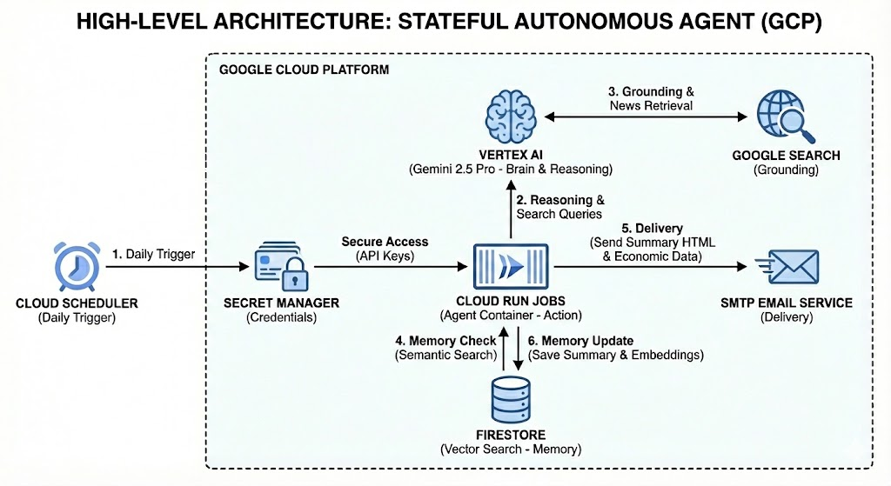

# Stateful AI Agent for News on Google Cloud Platform

This project implements a stateful autonomous agent that automates the process of finding, summarizing, and delivering news. It uses a **Brain-Memory-Action** architecture on Google Cloud Platform.



## Architecture

-   **Brain:** Vertex AI (Gemini 2.5 Pro) with Google Search Grounding for reasoning and content generation.
-   **Memory:** Cloud Firestore with Vector Search for semantic deduplication and persistence.
-   **Action:** Cloud Run Jobs for serverless, scheduled execution.
-   **ADK Refactoring:** The agent has been refactored using the Google Agent Development Kit (ADK) for better modularity and tool-calling capabilities.
-   **Security:** Secret Manager for secure credential management.

## Deployment Guide for GCP Architects

Follow these steps to deploy the agent in your Google Cloud Project.

### Prerequisites

1.  Google Cloud Project with billing enabled.
2.  gcloud CLI installed and authenticated.
3.  Enable necessary APIs:
    ```bash
    gcloud services enable run.googleapis.com cloudbuild.googleapis.com firestore.googleapis.com aiplatform.googleapis.com secretmanager.googleapis.com cloudscheduler.googleapis.com
    ```

### 1. Setup Firestore

Enable Firestore in Native mode and create a vector index for semantic search:

```bash
gcloud firestore indexes composite create \
--collection-group=news_agent_memory_topics \
--query-scope=COLLECTION \
--field-config=vector-config='{"dimension":"768","flat": "{}"}',field-path=embedding
```

### 2. Setup Secrets

Store sensitive credentials securely in Secret Manager. Replace placeholders with your actual values.

```bash
# Google API Key (if using AI Studio, otherwise optional for Vertex AI)
echo -n "YOUR_API_KEY" | gcloud secrets create GOOGLE_API_KEY --data-file=- --replication-policy="user-managed" --locations="us-central1"

# Gmail App Password
echo -n "YOUR_GMAIL_APP_PASSWORD" | gcloud secrets create GMAIL_PASSWORD --data-file=- --replication-policy="user-managed" --locations="us-central1"

# Grant access to Cloud Run service account
PROJECT_NUMBER=$(gcloud projects describe $(gcloud config get-value project) --format="value(projectNumber)")
SERVICE_ACCOUNT="${PROJECT_NUMBER}-compute@developer.gserviceaccount.com"

gcloud secrets add-iam-policy-binding GOOGLE_API_KEY --member="serviceAccount:${SERVICE_ACCOUNT}" --role="roles/secretmanager.secretAccessor"
gcloud secrets add-iam-policy-binding GMAIL_PASSWORD --member="serviceAccount:${SERVICE_ACCOUNT}" --role="roles/secretmanager.secretAccessor"
```

### 3. Build and Deploy

Build the container image and deploy the Cloud Run Job.

```bash
# Define variables
PROJECT_ID=$(gcloud config get-value project)
REGION="us-central1"
IMAGE_NAME="news-agent"
REPO_NAME="news-agent-repo" # Create this repo in Artifact Registry if it doesn't exist

# Create Artifact Registry repo (if needed)
gcloud artifacts repositories create ${REPO_NAME} --repository-format=docker --location=${REGION}

# Build and Push
gcloud builds submit --tag ${REGION}-docker.pkg.dev/${PROJECT_ID}/${REPO_NAME}/${IMAGE_NAME}:latest .

# Deploy Job
gcloud run jobs create news-agent-job \
--image ${REGION}-docker.pkg.dev/${PROJECT_ID}/${REPO_NAME}/${IMAGE_NAME}:latest \
--region ${REGION} \
--set-env-vars="NON_INTERACTIVE=true,GMAIL_USER=your-email@gmail.com,GOOGLE_CLOUD_PROJECT=${PROJECT_ID},BCC_EMAILS=other-email@example.com;another@example.com" \
--set-secrets="GOOGLE_API_KEY=GOOGLE_API_KEY:latest,GMAIL_PASSWORD=GMAIL_PASSWORD:latest" \
--task-timeout=1800
```

### 4. Schedule Execution

Create a Cloud Scheduler job to trigger the agent daily.

```bash
gcloud scheduler jobs create http news-agent-scheduler \
--location=${REGION} \
--schedule="0 8 * * *" \
--time-zone="America/Santiago" \
--uri="https://${REGION}-run.googleapis.com/v1/projects/${PROJECT_ID}/locations/${REGION}/jobs/news-agent-job:run" \
--http-method=POST \
--oauth-service-account-email=${SERVICE_ACCOUNT}
```

## ADK Agent Deployment (New)

The project now includes an improved version of the agent using the Google Agent Development Kit (ADK).

### 1. Build and Deploy ADK Agent

Use the provided script to build and deploy the ADK agent. This script handles the Docker build, push, and Cloud Run Job creation/update.

```bash
# Make the script executable
chmod +x deploy_adk.sh

# Run the deployment script
./deploy_adk.sh
```

The script will automatically set up the necessary environment variables and secrets for the ADK agent.

### 2. Schedule ADK Agent

Create a Cloud Scheduler job for the ADK agent:

```bash
gcloud scheduler jobs create http cuba-news-adk-scheduler \
--location=us-central1 \
--schedule="0 8 * * *" \
--time-zone="America/Santiago" \
--uri="https://us-central1-run.googleapis.com/apis/run.googleapis.com/v1/namespaces/YOUR_PROJECT_ID/jobs/cuba-news-adk-job:run" \
--http-method=POST \
--oauth-service-account-email=${SERVICE_ACCOUNT}
```

## Development

This project was developed using **Vibe Coding** with [Antigravity](https://antigravity.google/), demonstrating rapid prototyping and deployment of complex AI agents on GCP.
